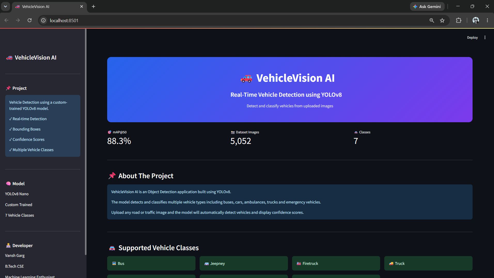
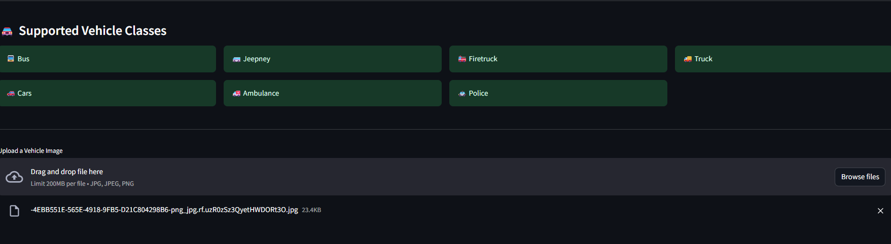
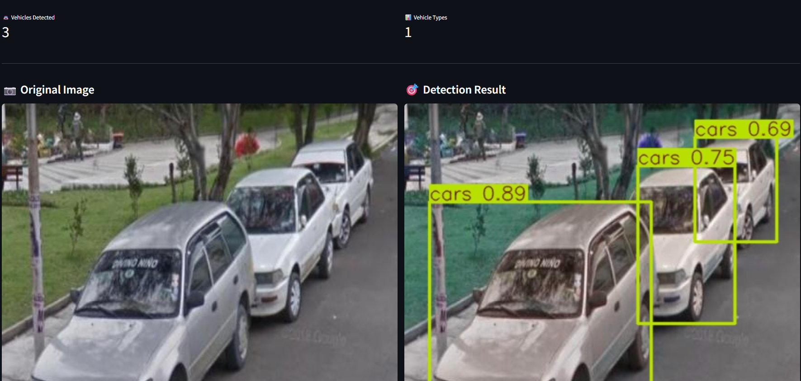
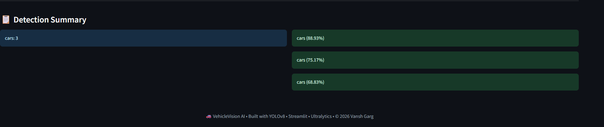

# 🚗 VehicleVision AI


## Overview

VehicleVision AI is a Deep Learning-based Object Detection project built using YOLOv8. The model is trained on a custom vehicle dataset and can detect and classify multiple vehicle categories from images in real-time.

The project is deployed through an interactive Streamlit web application where users can upload images and receive vehicle detections with bounding boxes, confidence scores, vehicle counts, and class-wise summaries.

---

## 🚀 Live Demo

🔗 **Web Application:**
https://vehiclevision-ai.streamlit.app/

🔗 **GitHub Repository:**
https://github.com/Vansh2639/VehicleVision-AI

---

## 📸 Screenshots

### Home Page



### Vehicle Detection Example





---

## Dataset

The model was trained on a custom vehicle detection dataset exported in YOLOv8 format.

The dataset contains annotated images of seven vehicle categories:

* Bus
* Jeepney
* Ambulance
* Cars
* Firetruck
* Police Vehicle
* Truck

Each image includes bounding box annotations for object detection training.

---

## Model Architecture

* Model: YOLOv8 Nano
* Framework: Ultralytics YOLOv8
* Task: Object Detection
* Classes: 7 Vehicle Categories
* Training Platform: Kaggle GPU

YOLOv8 was selected for its fast inference speed and strong real-time object detection performance.

---

## Training Details

* Framework: Ultralytics YOLOv8
* Optimizer: Default YOLO Optimizer
* Epochs: 20
* Image Size: 640 × 640
* GPU: NVIDIA Tesla T4
* Training Environment: Kaggle Notebooks

---

## Results

### Validation Performance

| Metric    | Score |
| --------- | ----- |
| Precision | 70.3% |
| Recall    | 85.7% |
| mAP@50    | 88.3% |
| mAP@50-95 | 70.3% |

### Class-wise Detection Performance

* Bus → 97.7% mAP@50
* Jeepney → 94.5% mAP@50
* Ambulance → 92.6% mAP@50
* Cars → 86.8% mAP@50
* Firetruck → 60.6% mAP@50
* Truck → 97.9% mAP@50

The model demonstrates strong detection performance across most vehicle categories.

---

## Streamlit Application

The deployed web application allows users to:

* Upload vehicle images
* Detect multiple vehicles in real-time
* Visualize bounding boxes
* View confidence scores
* View vehicle counts
* View class-wise detection summaries

---

## Project Structure

```text
VehicleVision-AI/

├── app.py
├── best.pt
├── requirements.txt
├── README.md
├── screenshots/
│   ├── home.png
│   └── detection.png
```

---

## Installation

Clone the repository:

```bash
git clone https://github.com/Vansh2639/VehicleVision-AI.git
```

Move into the project directory:

```bash
cd VehicleVision-AI
```

Install dependencies:

```bash
pip install -r requirements.txt
```

Run the application:

```bash
streamlit run app.py
```

---

## Technologies Used

* Python
* YOLOv8
* Ultralytics
* Streamlit
* OpenCV
* Pillow
* PyTorch
* NumPy

---

## Future Improvements

* Increase dataset size
* Improve Firetruck and Police detection accuracy
* Add video detection support
* Add webcam-based real-time detection
* Deploy using Docker
* Experiment with larger YOLOv8 variants

---

## Author

**Vansh Garg**

B.Tech CSE

Machine Learning & AI Enthusiast

---

⭐ If you found this project useful, consider giving it a star.
